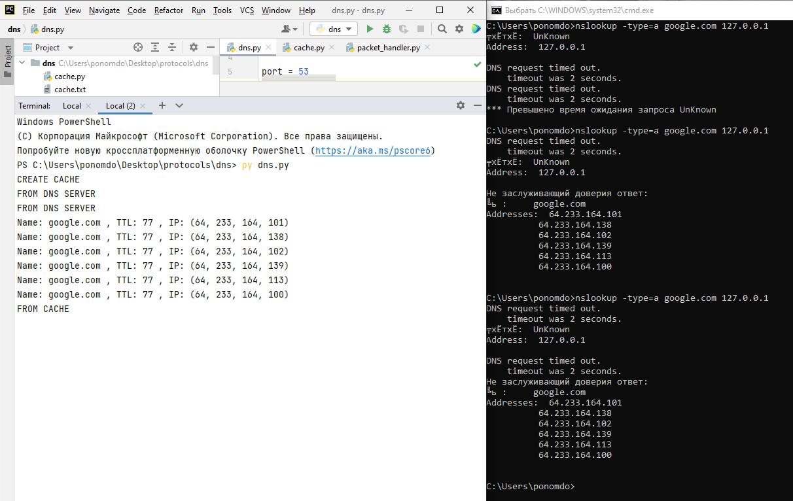

# Задача 4. Caching DNS

## Oписание  
Сервер получает от клиента запрос и выполняет его разрешение. Ожидает ответ от старшего сервера и, получив его, парсит пакет,   
извлекая из него информацию обо всех полях. Эти данные пишутся в кэш и при повторном запросе от клиента сервер возвращает необходимую информацию уже из кэша.   
Из кэша удаляются записи, у которых "вышел срок годности" относительно поля ttl. Изначально кэш пустой.   
Сервер не теряет работоспособность, даже если старший сервер почему-то не дал ответ.  
Поддерживаются запросы типа a, ns, aaaa.

## Запуск  
`py dns.py`

## Проверка  
Для проверки необходимо ввести команду, например:  
`nslookup -type=a google.com 127.0.0.1`
 
## Пример запуска  

